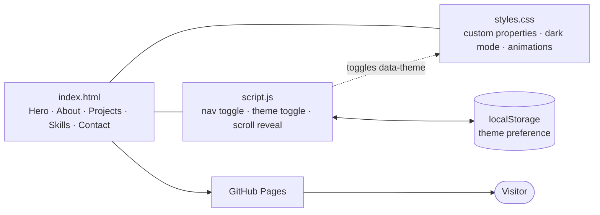

# Architecture

A single-page site in plain HTML, CSS and JavaScript — no framework, no build step.

```mermaid
flowchart LR
    HTML["index.html<br/>Hero · About · Projects · Skills · Contact"]
    CSS["styles.css<br/>custom properties · dark mode · animations"]
    JS["script.js<br/>nav toggle · theme toggle · scroll reveal"]
    LS[(localStorage<br/>theme preference)]
    Pages[GitHub Pages]
    User([Visitor])

    HTML --- CSS
    HTML --- JS
    JS <--> LS
    JS -.toggles data-theme.-> CSS
    HTML --> Pages --> User
```
